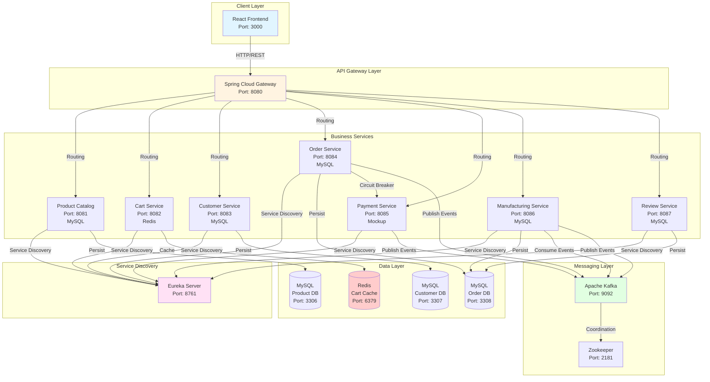
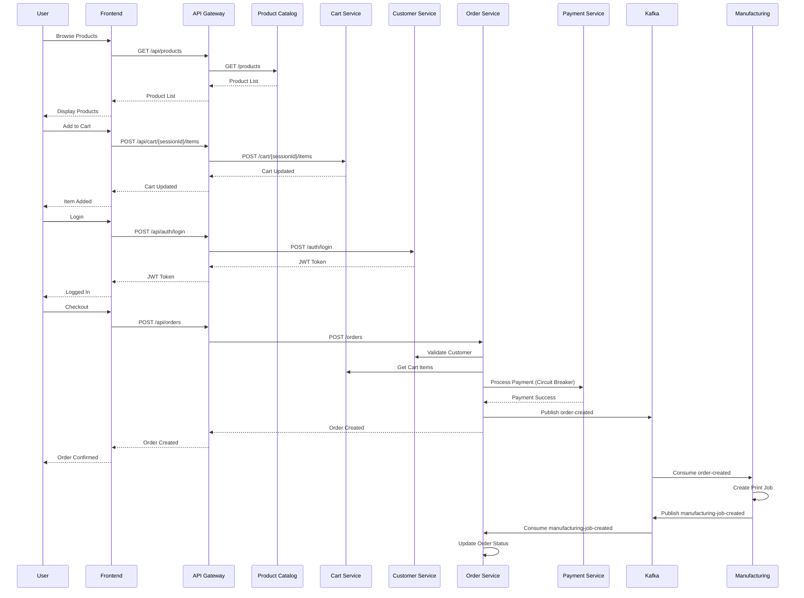
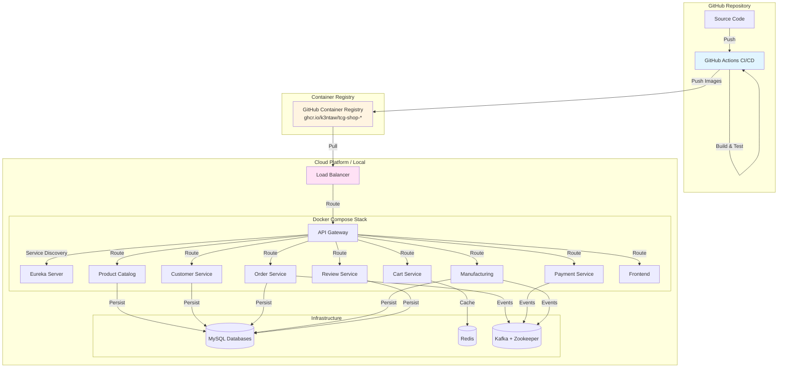
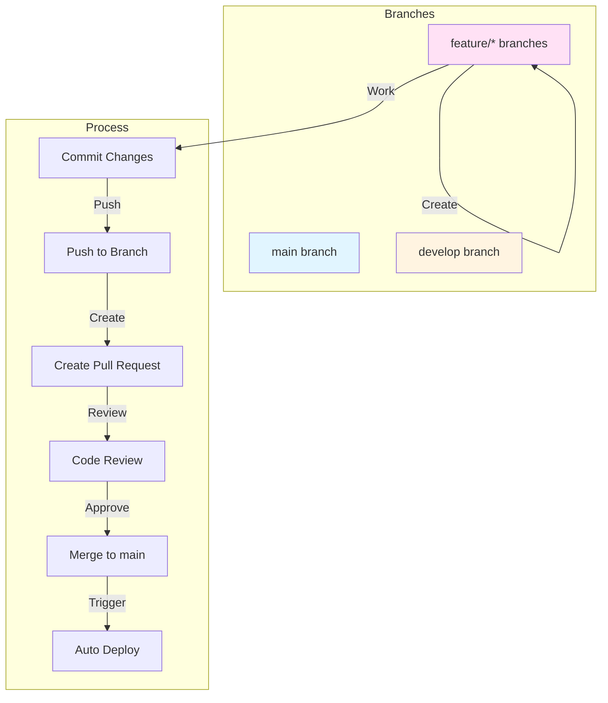
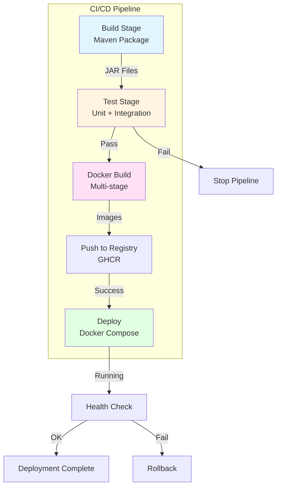
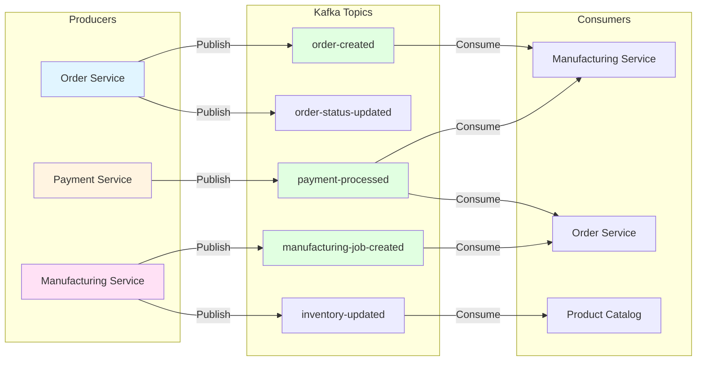
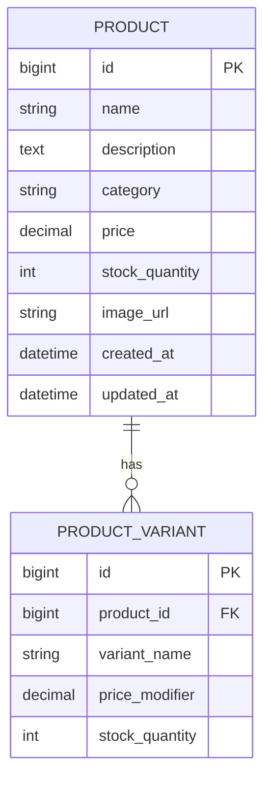
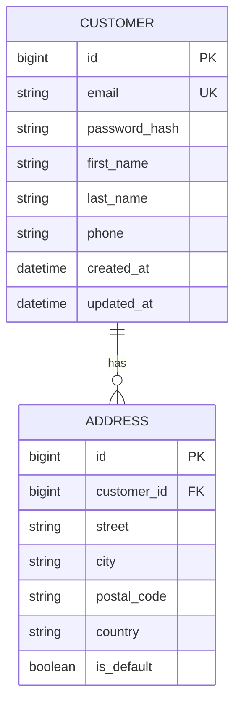
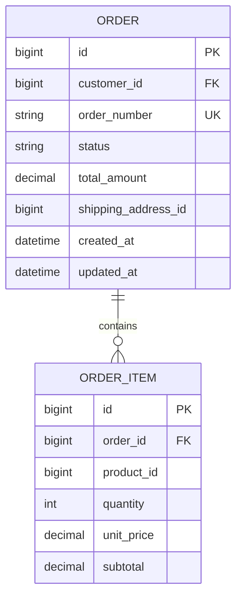

# Projektdefinition & Architektur

## 🎯 Projektidee

**TCG Accessories Shop** ist eine Microservices-basierte E-Commerce-Plattform für den Handel mit 3D-gedruckten Trading Card Game (TCG) Accessoires. Die Plattform ermöglicht es TCG-Spielern, personalisierte und standardisierte Accessoires für ihre Karten-Sammlungen zu bestellen.

### Kernfunktionalität

- **Produktkatalog**: 3D-gedruckte Accessoires (Deck Boxes, Card Holders, Storage Solutions, Playmats)
- **Kategorien**: Deck Boxes, Holders, Storage, Playmats & Accessories, Custom Designs
- **Kundenverwaltung**: Registrierung, Profile, Authentifizierung (JWT)
- **Bestellprozess**: Warenkorb, Checkout, Bestellverfolgung
- **Asynchrone Verarbeitung**: Event-basierte Order-Processing mit Kafka
- **Circuit Breaker**: Resilience-Pattern für Payment Service Integration

## 🏗️ Architekturskizze

### Gesamtarchitektur

### Request Flow Diagramm

### Deployment-Architektur

## 📋 Workflow im Projekt

### 1. Entwicklungs-Workflow

```mermaid
graph LR
    A[Local Development] -->|Code| B[Git Commit]
    B -->|Push| C[GitHub Repository]
    C -->|Trigger| D[GitHub Actions]
    D -->|Build| E[Maven Build]
    E -->|Test| F[Unit Tests]
    F -->|Package| G[Docker Build]
    G -->|Push| H[Container Registry]
    H -->|Deploy| I[Cloud/Local]
    
    style D fill:#e1f5ff
    style H fill:#fff4e1
```

### 2. Git-Workflow

### 3. Deployment-Workflow

## 🎨 User Interface

Die Benutzeroberfläche bietet:

- **Modernes, responsives Design** mit TailwindCSS
- **Produktkatalog** mit Filter- und Suchfunktionen
- **Warenkorb** mit Real-Time Updates (Redis-basiert)
- **Checkout-Prozess** mit Formular-Validierung
- **Bestellhistorie** und Tracking
- **Produktbewertungen** und Rezensionen

### Frontend-Seiten

- **Home Page**: Übersicht und Featured Products
- **Products Page**: Produktkatalog mit Kategorien
- **Product Detail Page**: Einzelproduktansicht mit Bewertungen
- **Cart Page**: Warenkorb-Verwaltung
- **Checkout Page**: Bestellabwicklung
- **Login/Register**: Authentifizierung

## 🔧 Technologie-Stack

### Frontend

- **React 18**: Moderne Component-basierte UI
- **TypeScript**: Type-Safety für robuste Entwicklung
- **Vite**: Schneller Build-Prozess
- **TailwindCSS**: Utility-First CSS Framework
- **Shadcn/ui**: Hochwertige UI-Komponenten
- **Axios**: HTTP Client für API-Kommunikation
- **React Router**: Client-side Routing

### Backend

- **Spring Boot 3.3.6**: Enterprise Java Framework
- **Spring Data JPA**: Datenbank-Abstraktion
- **Spring Cloud Gateway**: API Gateway mit Resilience
- **Netflix Eureka**: Service Discovery
- **Apache Kafka**: Event Streaming Platform
- **Resilience4j**: Circuit Breaker Pattern
- **MySQL 8.0**: Relationale Datenbank
- **Redis**: In-Memory Cache für Warenkorb

### DevOps

- **Docker**: Container-Virtualisierung
- **Docker Compose**: Multi-Container Orchestrierung
- **Maven**: Build-Management für Java
- **npm**: Package Management für Frontend
- **GitHub Actions**: CI/CD Pipeline
- **GitHub Container Registry**: Docker Image Registry

### Testing & Quality

- **JUnit 5**: Unit Testing Framework
- **Mockito**: Mocking Framework
- **AssertJ**: Fluent Assertions
- **Postman**: API Testing
- **Spring Boot Test**: Integration Testing

## 📊 Microservices Übersicht

| Service      | Port | Funktion                 | Technologie            | Datenbank |
| ------------ | ---- | ------------------------ | ---------------------- | --------- |
| **Frontend** | 3000 | User Interface           | React + TypeScript     | -         |
| **Gateway**  | 8080 | API Gateway, Routing     | Spring Cloud Gateway   | -         |
| **Eureka**   | 8761 | Service Discovery        | Netflix Eureka         | -         |
| **Product**  | 8081 | Produktverwaltung        | Spring Boot            | MySQL     |
| **Cart**     | 8082 | Warenkorb-Verwaltung     | Spring Boot            | Redis     |
| **Customer** | 8083 | Kundenverwaltung, Auth   | Spring Boot            | MySQL     |
| **Order**    | 8084 | Bestellverwaltung        | Spring Boot            | MySQL     |
| **Payment**  | 8085 | Zahlungsverarbeitung    | Spring Boot (Mockup)   | In-Memory |
| **Manufacturing** | 8086 | 3D-Druck-Jobs          | Spring Boot            | MySQL     |
| **Review**   | 8087 | Produktbewertungen       | Spring Boot            | MySQL     |
| **MySQL**    | 3306-3308 | Datenpersistierung       | MySQL 8.0              | -         |
| **Redis**    | 6379 | Warenkorb-Cache          | Redis 7                | -         |
| **Kafka**    | 9092 | Event Streaming          | Apache Kafka           | -         |
| **Zookeeper** | 2181 | Kafka Coordination       | Zookeeper              | -         |

## 🎯 Architektur-Entscheidungen

### Warum Microservices?

1. **Skalierbarkeit**: Einzelne Services können unabhängig skaliert werden
   - Product Catalog Service kann bei hoher Last skaliert werden
   - Cart Service nutzt Redis für schnelle Zugriffe
2. **Wartbarkeit**: Kleinere, fokussierte Codebases
   - Jeder Service hat klare Verantwortlichkeiten
   - Unabhängige Entwicklung und Deployment
3. **Technologie-Flexibilität**: Verschiedene Tech-Stacks pro Service möglich
   - Redis für Cart (NoSQL, in-memory)
   - MySQL für persistente Daten (relational)
4. **Fehler-Isolation**: Probleme in einem Service betreffen nicht das gesamte System
   - Circuit Breaker Pattern schützt vor Kaskadenfehlern

### Warum API Gateway?

1. **Single Entry Point**: Einheitlicher Zugriffspunkt für Clients
   - Alle Requests gehen über Port 8080
   - Zentrale Konfiguration von Routing
2. **Cross-Cutting Concerns**: CORS, Authentication, Rate Limiting zentral
   - JWT-Validierung im Gateway
   - Request/Response Transformation
3. **Circuit Breaker**: Fehlertoleranz bei Service-Ausfällen
   - Integration mit Resilience4j
4. **Load Balancing**: Automatische Lastverteilung über Eureka

### Warum Kafka?

1. **Asynchrone Verarbeitung**: Entkopplung von Services
   - Order Service muss nicht warten, bis Manufacturing Service bereit ist
   - Event-driven Architecture
2. **Event Sourcing**: Vollständige Event-History
   - Alle Events werden persistent gespeichert
   - Replay-Funktionalität möglich
3. **Skalierbarkeit**: Millionen Events pro Sekunde
   - Hoher Durchsatz für Bestellungen
4. **Reliability**: Garantierte Event-Zustellung
   - At-least-once Delivery
   - Consumer Groups für parallele Verarbeitung

### Warum Eureka?

1. **Service Discovery**: Automatische Service-Registrierung
   - Services registrieren sich selbständig
   - Dynamische Service-Erkennung
2. **Health Monitoring**: Automatische Erkennung von Service-Ausfällen
   - Health Checks integriert
   - Automatische Deregistrierung bei Ausfall
3. **Load Balancing**: Integration mit Spring Cloud LoadBalancer
   - Automatische Lastverteilung
4. **Zero-Configuration**: Services registrieren sich selbständig
   - Keine manuelle Konfiguration nötig

### Warum Circuit Breaker?

1. **Resilience**: System bleibt stabil bei Teilausfällen
   - Payment Service-Ausfall blockiert nicht Bestellungen
   - Fallback-Mechanismen aktivieren sich automatisch
2. **Performance**: Vermeidet Timeouts bei fehlerhaften Services
   - Schnelle Fehlerbehandlung
   - Keine Wartezeiten bei bekannten Fehlern
3. **User Experience**: Schnelle Fehlerbehandlung
   - Bestellungen werden als "Payment Pending" markiert
   - Manuelle Nachbearbeitung möglich

## 📈 Projektziele

### Funktionale Ziele

- ✅ Vollständiger E-Commerce-Workflow implementiert
- ✅ Produktverwaltung mit Kategorien und Varianten
- ✅ Kundenverwaltung mit Registrierung und Authentifizierung
- ✅ Warenkorb-Verwaltung mit Redis-Persistierung
- ✅ Bestellprozess mit Event-basierter Verarbeitung
- ✅ Circuit Breaker für Payment Service Integration
- ✅ Kafka-basierte asynchrone Kommunikation

### Nicht-funktionale Ziele

- ✅ Microservices-Architektur mit klaren Grenzen
- ✅ Hohe Verfügbarkeit durch Circuit Breaker
- ✅ Skalierbarkeit durch Container und Service Discovery
- ✅ Testabdeckung mit Unit und Integration Tests
- ✅ API-Dokumentation mit Postman Collections
- ✅ CI/CD Pipeline mit GitHub Actions
- ✅ Docker-basierte Deployment-Strategie

### Lernziele

- ✅ Praktische Erfahrung mit Microservices-Architektur
- ✅ Event-Driven Architecture mit Kafka
- ✅ API Gateway Pattern Implementation
- ✅ Circuit Breaker Pattern mit Resilience4j
- ✅ Container-Orchestrierung mit Docker Compose
- ✅ Service Discovery mit Eureka
- ✅ Moderne Frontend-Entwicklung mit React
- ✅ CI/CD Pipeline Setup und Deployment

## 🔄 Event Flow (Kafka Topics)

## 📝 Datenbank-Design

### Product Catalog Service (MySQL)

### Customer Service (MySQL)

### Order Service (MySQL)

---

**Aufgabe 1 erfüllt**: ✅ Architekturskizze erstellt, Projektidee beschrieben, Workflow dokumentiert

_Nächstes Dokument_: [docs/ARCHITEKTUR.md](docs/ARCHITEKTUR.md) - Technische Vertiefung

