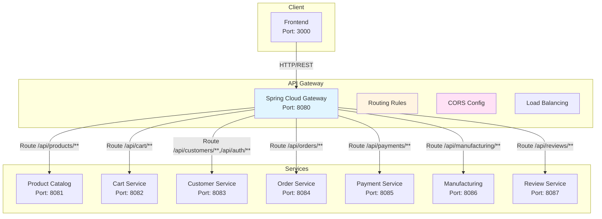
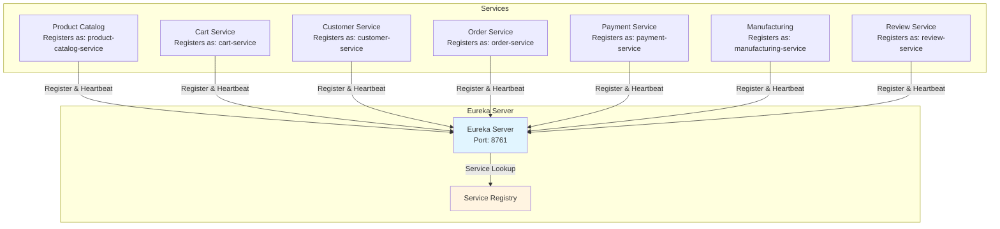
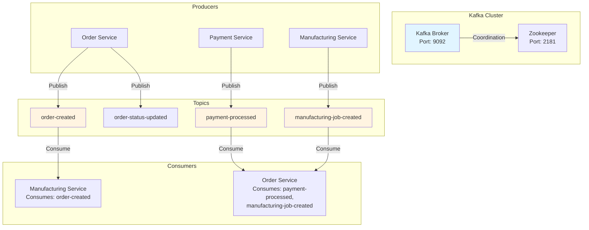
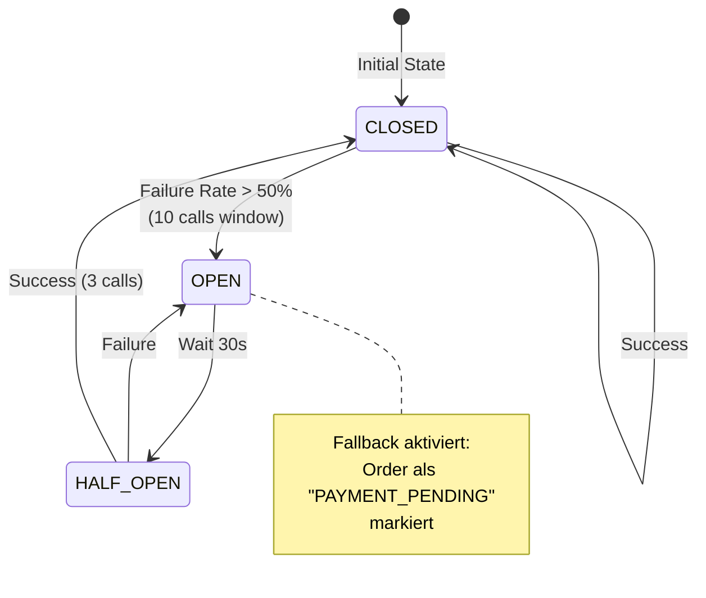
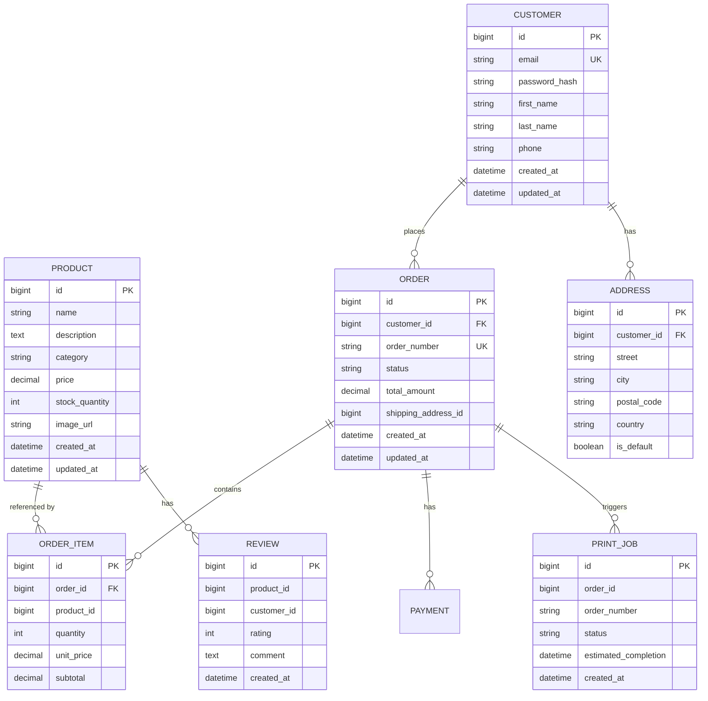
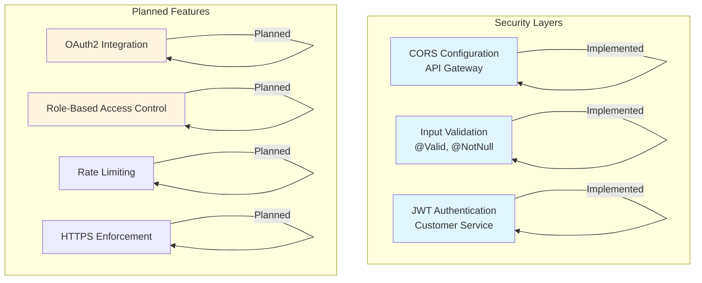
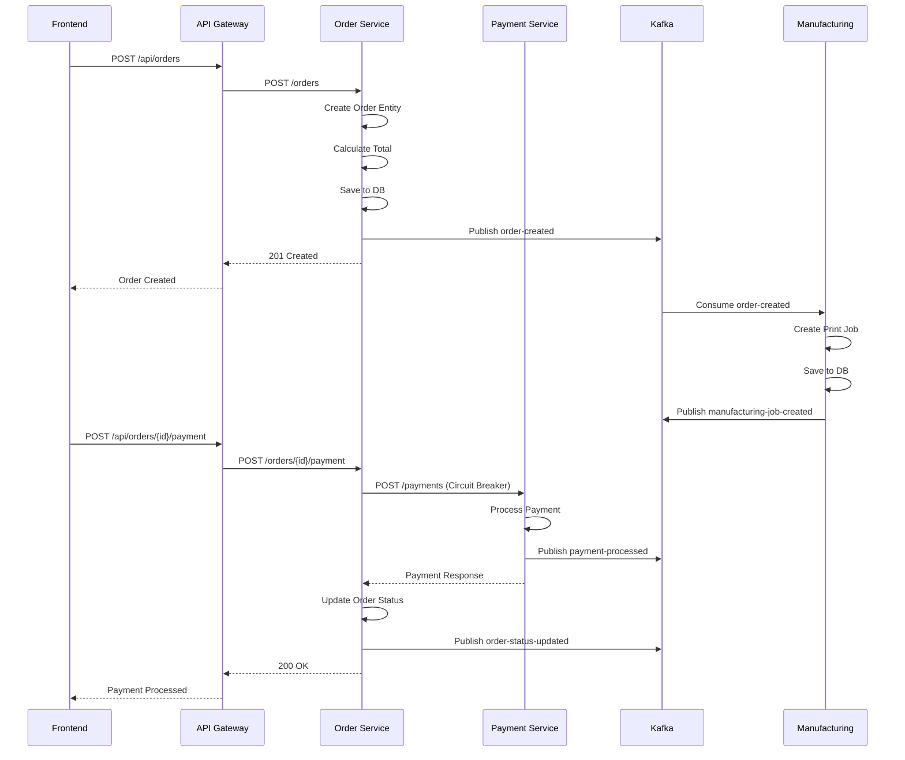

# Architektur-Details

Dieses Dokument beschreibt die technische Implementierung der TCG Accessories Shop Microservices-Architektur im Detail.

## 📐 Architektur-Patterns

### 1. API Gateway Pattern

Das Gateway ist der zentrale Einstiegspunkt für alle Client-Anfragen.



#### Gateway Konfiguration

**application.yml** (API Gateway):

```yaml
server:
  port: 8080

spring:
  application:
    name: api-gateway
  cloud:
    gateway:
      httpclient:
        connect-timeout: 10000
        response-timeout: 60000
      routes:
        # Product Catalog Service
        - id: product-catalog-service
          uri: lb://product-catalog-service
          predicates:
            - Path=/api/products/**
          filters:
            - StripPrefix=1

        # Cart Service
        - id: cart-service
          uri: lb://cart-service
          predicates:
            - Path=/api/cart/**
          filters:
            - StripPrefix=1

        # Customer Service
        - id: customer-service
          uri: lb://customer-service
          predicates:
            - Path=/api/customers/**,/api/auth/**
          filters:
            - StripPrefix=1

        # Order Service
        - id: order-service
          uri: lb://order-service
          predicates:
            - Path=/api/orders/**
          filters:
            - StripPrefix=1

        # Payment Service
        - id: payment-service
          uri: lb://payment-service
          predicates:
            - Path=/api/payments/**
          filters:
            - StripPrefix=1

        # Manufacturing Service
        - id: manufacturing-service
          uri: lb://manufacturing-service
          predicates:
            - Path=/api/manufacturing/**
          filters:
            - StripPrefix=1

        # Review Service
        - id: review-service
          uri: lb://review-service
          predicates:
            - Path=/api/reviews/**
          filters:
            - StripPrefix=1

      globalcors:
        cors-configurations:
          '[/**]':
            allowedOriginPatterns: "*"
            allowedMethods:
              - GET
              - POST
              - PUT
              - DELETE
              - OPTIONS
            allowedHeaders: "*"
            allowCredentials: false

eureka:
  client:
    service-url:
      defaultZone: ${EUREKA_CLIENT_SERVICEURL_DEFAULTZONE:http://localhost:8761/eureka/}
```

**Vorteile**:

- ✅ Single Entry Point für alle API-Requests
- ✅ Zentrale CORS-Konfiguration
- ✅ Load Balancing über Eureka (`lb://service-name`)
- ✅ Request/Response Transformation mit `StripPrefix`
- ✅ Timeout-Konfiguration für bessere Resilienz

### 2. Service Discovery Pattern

Eureka ermöglicht automatische Service-Registrierung und -Erkennung.



#### Eureka Konfiguration

**Eureka Server - application.yml**:

```yaml
server:
  port: 8761

spring:
  application:
    name: eureka-server

eureka:
  instance:
    hostname: localhost
  client:
    register-with-eureka: false
    fetch-registry: false
    service-url:
      defaultZone: http://${eureka.instance.hostname}:${server.port}/eureka/
```

**Service Client - application.yml** (Beispiel: Order Service):

```yaml
spring:
  application:
    name: order-service  # Service Name in Registry

eureka:
  client:
    service-url:
      defaultZone: ${EUREKA_CLIENT_SERVICEURL_DEFAULTZONE:http://localhost:8761/eureka/}
  instance:
    prefer-ip-address: false
```

**Vorteile**:

- ✅ Keine hartcodierten Service-URLs
- ✅ Automatisches Load Balancing über `lb://service-name`
- ✅ Health Monitoring inklusive
- ✅ Dynamische Skalierung möglich
- ✅ Automatische Deregistrierung bei Service-Ausfall

### 3. Event-Driven Architecture

Kafka ermöglicht asynchrone, entkoppelte Kommunikation zwischen Services.



#### Kafka Integration

**Order Service - Kafka Producer**:

```java
@Service
@Transactional
public class OrderService {
    
    private final KafkaTemplate<String, Object> kafkaTemplate;
    
    public OrderDTO createOrder(CreateOrderRequest request) {
        Order order = new Order();
        // ... order creation logic ...
        Order savedOrder = orderRepository.save(order);
        
        // Publish Kafka event: order-created
        Map<String, Object> event = new HashMap<>();
        event.put("orderId", savedOrder.getId());
        event.put("orderNumber", savedOrder.getOrderNumber());
        event.put("customerId", savedOrder.getCustomerId());
        event.put("totalAmount", savedOrder.getTotalAmount());
        kafkaTemplate.send("order-created", event);
        
        return convertToDTO(savedOrder);
    }
}
```

**Manufacturing Service - Kafka Consumer**:

```java
@Component
public class OrderCreatedConsumer {
    
    private final ManufacturingService manufacturingService;
    
    @KafkaListener(topics = "order-created", groupId = "manufacturing-service")
    public void handleOrderCreated(Map<String, Object> event) {
        Long orderId = Long.valueOf(event.get("orderId").toString());
        String orderNumber = (String) event.get("orderNumber");
        
        // Create print job for the order
        manufacturingService.createPrintJob(orderId, orderNumber);
    }
}
```

**Kafka Konfiguration - application.yml**:

```yaml
spring:
  kafka:
    bootstrap-servers: ${SPRING_KAFKA_BOOTSTRAP_SERVERS:localhost:9092}
    consumer:
      group-id: order-service
      auto-offset-reset: earliest
      key-deserializer: org.apache.kafka.common.serialization.StringDeserializer
      value-deserializer: org.springframework.kafka.support.serializer.JsonDeserializer
      properties:
        spring.json.trusted.packages: "*"
    producer:
      key-serializer: org.apache.kafka.common.serialization.StringSerializer
      value-serializer: org.springframework.kafka.support.serializer.JsonSerializer
```

**Vorteile**:

- ✅ Services sind entkoppelt (Loose Coupling)
- ✅ Asynchrone Verarbeitung (Non-Blocking)
- ✅ Event-History verfügbar für Analytics
- ✅ Horizontale Skalierbarkeit durch Consumer Groups
- ✅ Garantierte Event-Zustellung (At-least-once)

### 4. Circuit Breaker Pattern

Resilience4j schützt vor Cascade-Failures.



#### Circuit Breaker Konfiguration

**Order Service - application.yml**:

```yaml
# Circuit Breaker Configuration (Resilience4j)
resilience4j:
  circuitbreaker:
    instances:
      paymentService:
        registerHealthIndicator: true
        slidingWindowSize: 10
        minimumNumberOfCalls: 5
        permittedNumberOfCallsInHalfOpenState: 3
        automaticTransitionFromOpenToHalfOpenEnabled: true
        waitDurationInOpenState: 30s
        failureRateThreshold: 50
        eventConsumerBufferSize: 10
  timelimiter:
    instances:
      paymentService:
        timeoutDuration: 5s

feign:
  circuitbreaker:
    enabled: true
  resilience4j:
    enabled: true
```

**Feign Client mit Fallback**:

```java
@FeignClient(name = "payment-service", fallback = PaymentServiceClientFallback.class)
public interface PaymentServiceClient {
    
    @PostMapping("/payments")
    Map<String, Object> processPayment(@RequestBody Map<String, Object> paymentRequest);
}
```

**Fallback Implementation**:

```java
@Component
public class PaymentServiceClientFallback implements PaymentServiceClient {
    
    @Override
    public Map<String, Object> processPayment(Map<String, Object> paymentRequest) {
        Map<String, Object> response = new HashMap<>();
        response.put("status", "PENDING");
        response.put("message", "Payment service temporarily unavailable. Order marked as payment pending.");
        response.put("orderId", paymentRequest.get("orderId"));
        return response;
    }
}
```

**Vorteile**:

- ✅ Verhindert Cascade-Failures
- ✅ Schnelles Fail für Clients (kein langes Warten)
- ✅ Automatische Recovery nach 30 Sekunden
- ✅ System-Stabilität erhöht
- ✅ Graceful Degradation mit Fallback

## 🗄️ Datenbank-Schema

### Entity-Relationship Diagramm



### Datenbank-Per-Service Prinzip

| Service | Datenbank | Port | Begründung |
|---------|-----------|------|------------|
| **Product Catalog** | MySQL | 3306 | Relationale Daten, Produktbeziehungen |
| **Customer** | MySQL | 3307 | Strukturierte Kundendaten, Compliance |
| **Order** | MySQL | 3308 | Transaktionale Daten, Audit-Trail |
| **Cart** | Redis | 6379 | Schnelle Zugriffe, Session-Management, temporäre Daten |
| **Manufacturing** | MySQL | 3308 | Print-Job Tracking (shared mit Order DB) |
| **Review** | MySQL | 3308 | Bewertungsdaten (shared mit Order DB) |
| **Payment** | In-Memory | - | Mockup, keine persistente Speicherung |

**Vorteile**:

- ✅ **Unabhängigkeit**: Services können unabhängig deployed werden
- ✅ **Skalierbarkeit**: Jede DB kann separat skaliert werden
- ✅ **Technologie-Flexibilität**: Verschiedene DB-Typen je nach Anforderung
- ✅ **Fehler-Isolation**: DB-Ausfall betrifft nur einen Service

### Indizes für Performance

```sql
-- Product Catalog Service
CREATE INDEX idx_product_category ON products(category);
CREATE INDEX idx_product_stock ON products(stock_quantity);
CREATE INDEX idx_product_name ON products(name);

-- Customer Service
CREATE INDEX idx_customer_email ON customers(email);
CREATE INDEX idx_address_customer_id ON addresses(customer_id);

-- Order Service
CREATE INDEX idx_order_customer_id ON orders(customer_id);
CREATE INDEX idx_order_status ON orders(status);
CREATE INDEX idx_order_number ON orders(order_number);
CREATE INDEX idx_order_item_order_id ON order_items(order_id);
```

## 🔄 API-Architektur

### REST API Design

```mermaid
graph TB
    subgraph "API Gateway"
        GW[Port: 8080]
    end
    
    subgraph "Product Catalog API"
        PC1[GET /api/products]
        PC2[GET /api/products/{id}]
        PC3[GET /api/products/category/{category}]
        PC4[GET /api/products/search?q={term}]
        PC5[POST /api/products]
        PC6[PUT /api/products/{id}]
        PC7[DELETE /api/products/{id}]
    end
    
    subgraph "Cart API"
        CART1[GET /api/cart/{sessionId}]
        CART2[POST /api/cart/{sessionId}/items]
        CART3[PUT /api/cart/{sessionId}/items/{itemId}]
        CART4[DELETE /api/cart/{sessionId}/items/{itemId}]
        CART5[DELETE /api/cart/{sessionId}]
    end
    
    subgraph "Customer API"
        CUST1[POST /api/auth/register]
        CUST2[POST /api/auth/login]
        CUST3[GET /api/customers/{id}]
        CUST4[PUT /api/customers/{id}]
    end
    
    subgraph "Order API"
        ORD1[POST /api/orders]
        ORD2[GET /api/orders/{id}]
        ORD3[GET /api/orders/customer/{customerId}]
        ORD4[POST /api/orders/{id}/payment]
        ORD5[PUT /api/orders/{id}/status]
    end
    
    GW --> PC1
    GW --> PC2
    GW --> PC3
    GW --> PC4
    GW --> PC5
    GW --> PC6
    GW --> PC7
    GW --> CART1
    GW --> CART2
    GW --> CART3
    GW --> CART4
    GW --> CART5
    GW --> CUST1
    GW --> CUST2
    GW --> CUST3
    GW --> CUST4
    GW --> ORD1
    GW --> ORD2
    GW --> ORD3
    GW --> ORD4
    GW --> ORD5
```

### API Endpoints Übersicht

#### Product Catalog API

| Method | Endpoint                         | Beschreibung       | Request Body | Response     |
| ------ | -------------------------------- | ------------------ | ------------ | ------------ |
| GET    | `/api/products`                 | Alle Produkte      | -            | 200 + List   |
| GET    | `/api/products/{id}`             | Einzelnes Produkt  | -            | 200 + Object |
| GET    | `/api/products/category/{category}` | Produkte nach Kategorie | - | 200 + List |
| GET    | `/api/products/search?q={term}` | Produktsuche       | -            | 200 + List   |
| GET    | `/api/products/stock`            | Produkte auf Lager | -            | 200 + List   |
| POST   | `/api/products`                  | Neues Produkt      | ProductDto   | 201 + Object |
| PUT    | `/api/products/{id}`             | Update Produkt     | ProductDto   | 200 + Object |
| DELETE | `/api/products/{id}`             | Lösche Produkt     | -            | 204          |

#### Cart API

| Method | Endpoint                                    | Beschreibung          | Request Body | Response     |
| ------ | ------------------------------------------- | --------------------- | ------------ | ------------ |
| GET    | `/api/cart/{sessionId}`                    | Warenkorb abrufen     | -            | 200 + Object |
| POST   | `/api/cart/{sessionId}/items`               | Produkt hinzufügen    | CartItemDto  | 200 + Object |
| PUT    | `/api/cart/{sessionId}/items/{itemId}`      | Menge aktualisieren   | CartItemDto  | 200 + Object |
| DELETE | `/api/cart/{sessionId}/items/{itemId}`      | Produkt entfernen      | -            | 204          |
| DELETE | `/api/cart/{sessionId}`                    | Warenkorb leeren      | -            | 204          |

#### Customer API

| Method | Endpoint                       | Beschreibung     | Request Body | Response     |
| ------ | ------------------------------ | ---------------- | ------------ | ------------ |
| POST   | `/api/auth/register`           | Registrierung    | RegisterDto  | 201 + Object |
| POST   | `/api/auth/login`              | Login            | LoginDto     | 200 + JWT    |
| GET    | `/api/customers/{id}`          | Kundenprofil     | -            | 200 + Object |
| PUT    | `/api/customers/{id}`          | Update Profil    | CustomerDto   | 200 + Object |
| GET    | `/api/customers/{id}/addresses` | Adressen abrufen | -            | 200 + List   |
| POST   | `/api/customers/{id}/addresses` | Adresse hinzufügen | AddressDto | 201 + Object |

#### Orders API

| Method | Endpoint                    | Beschreibung              | Request Body | Response     |
| ------ | --------------------------- | ------------------------- | ------------ | ------------ |
| POST   | `/api/orders`               | Neue Bestellung           | OrderDto     | 201 + Object |
| GET    | `/api/orders/{id}`          | Einzelne Bestellung       | -            | 200 + Object |
| GET    | `/api/orders/customer/{id}` | Bestellungen eines Kunden | -            | 200 + List   |
| POST   | `/api/orders/{id}/payment`   | Zahlung verarbeiten       | -            | 200 + Object |
| PUT    | `/api/orders/{id}/status`   | Update Status             | StatusDto    | 200 + Object |

### Request/Response Beispiele

**POST /api/orders - Request**:

```json
{
  "customerId": 1,
  "shippingAddressId": 1,
  "items": [
    {
      "productId": 5,
      "quantity": 2,
      "unitPrice": 29.99
    },
    {
      "productId": 8,
      "quantity": 1,
      "unitPrice": 49.99
    }
  ]
}
```

**POST /api/orders - Response (201 Created)**:

```json
{
  "id": 42,
  "orderNumber": "ORD-2025-001-42",
  "customerId": 1,
  "status": "PENDING",
  "totalAmount": 109.97,
  "shippingAddressId": 1,
  "items": [
    {
      "id": 101,
      "productId": 5,
      "quantity": 2,
      "unitPrice": 29.99,
      "subtotal": 59.98
    },
    {
      "id": 102,
      "productId": 8,
      "quantity": 1,
      "unitPrice": 49.99,
      "subtotal": 49.99
    }
  ],
  "createdAt": "2025-01-17T10:30:00Z",
  "updatedAt": "2025-01-17T10:30:00Z"
}
```

**POST /api/cart/{sessionId}/items - Request**:

```json
{
  "productId": 5,
  "productName": "Premium Deck Box",
  "quantity": 2,
  "price": 29.99
}
```

**POST /api/cart/{sessionId}/items - Response (200 OK)**:

```json
{
  "sessionId": "session-1764861335728-blrqsm33z",
  "items": [
    {
      "id": "item-1",
      "productId": 5,
      "productName": "Premium Deck Box",
      "quantity": 2,
      "price": 29.99
    }
  ],
  "total": 59.98,
  "updatedAt": "2025-01-17T10:30:00Z"
}
```

## 🏗️ Layered Architecture

```mermaid
graph TB
    subgraph "Presentation Layer"
        CTRL[Controller<br/>@RestController<br/>Request/Response Handling]
    end
    
    subgraph "Business Logic Layer"
        SVC[Service<br/>@Service<br/>Business Rules, Validation]
    end
    
    subgraph "Data Access Layer"
        REPO[Repository<br/>@Repository<br/>Spring Data JPA]
    end
    
    subgraph "Domain Layer"
        ENT[Entity<br/>JPA @Entity<br/>Domain Models]
        DTO[DTO<br/>Data Transfer Objects]
    end
    
    CTRL -->|Uses| SVC
    SVC -->|Uses| REPO
    REPO -->|Manages| ENT
    CTRL -->|Returns| DTO
    SVC -->|Converts| DTO
    
    style CTRL fill:#e1f5ff
    style SVC fill:#fff4e1
    style REPO fill:#ffe1f5
    style ENT fill:#e1ffe1
```

### Schichten-Beschreibung

#### 1. Presentation Layer (Controller)

- **Verantwortung**: HTTP Request/Response Handling
- **Technologien**: Spring MVC, `@RestController`, `@RequestMapping`
- **Beispiel**: `OrderController`, `ProductController`, `CartController`

**Beispiel - OrderController**:

```java
@RestController
@RequestMapping("/orders")
@CrossOrigin(origins = "*")
public class OrderController {
    
    private final OrderService orderService;
    
    @PostMapping
    public ResponseEntity<OrderDTO> createOrder(
            @Valid @RequestBody CreateOrderRequest request) {
        OrderDTO order = orderService.createOrder(request);
        return ResponseEntity.status(HttpStatus.CREATED).body(order);
    }
    
    @GetMapping("/{id}")
    public ResponseEntity<OrderDTO> getOrderById(@PathVariable Long id) {
        OrderDTO order = orderService.getOrderById(id);
        return ResponseEntity.ok(order);
    }
}
```

#### 2. Business Logic Layer (Service)

- **Verantwortung**: Business Rules, Validierung, Orchestrierung
- **Technologien**: `@Service`, `@Transactional`
- **Beispiel**: `OrderService`, `ProductService`, `CartService`

**Beispiel - OrderService**:

```java
@Service
@Transactional
public class OrderService {
    
    private final OrderRepository orderRepository;
    private final PaymentServiceClient paymentServiceClient;
    private final KafkaTemplate<String, Object> kafkaTemplate;
    
    public OrderDTO createOrder(CreateOrderRequest request) {
        // Business logic: Create order, calculate total, etc.
        Order order = new Order();
        // ... order creation ...
        
        // Publish event
        kafkaTemplate.send("order-created", event);
        
        return convertToDTO(order);
    }
}
```

#### 3. Data Access Layer (Repository)

- **Verantwortung**: Datenbank-Operationen
- **Technologien**: Spring Data JPA, Hibernate
- **Beispiel**: `OrderRepository`, `ProductRepository`, `CustomerRepository`

**Beispiel - OrderRepository**:

```java
@Repository
public interface OrderRepository extends JpaRepository<Order, Long> {
    
    List<Order> findByCustomerId(Long customerId);
    
    Optional<Order> findByOrderNumber(String orderNumber);
    
    @Query("SELECT o FROM Order o WHERE o.status = :status")
    List<Order> findByStatus(@Param("status") OrderStatus status);
}
```

#### 4. Domain Layer

- **Verantwortung**: Domain Models, DTOs
- **Technologien**: JPA Entities, POJOs
- **Beispiel**: `Order`, `Product`, `Customer`, `OrderDTO`

**Beispiel - Order Entity**:

```java
@Entity
@Table(name = "orders")
public class Order {
    
    @Id
    @GeneratedValue(strategy = GenerationType.IDENTITY)
    private Long id;
    
    @Column(unique = true)
    private String orderNumber;
    
    private Long customerId;
    
    @Enumerated(EnumType.STRING)
    private OrderStatus status;
    
    @OneToMany(mappedBy = "order", cascade = CascadeType.ALL)
    private List<OrderItem> items = new ArrayList<>();
    
    // Getters and Setters
}
```

## 🔐 Security Konzept

### Aktuelle Security-Features



**Aktuelle Implementierung**:

- ✅ **CORS-Konfiguration** im API Gateway
- ✅ **Input-Validierung** mit `@Valid`, `@NotNull`, `@NotBlank`
- ✅ **JWT-basierte Authentication** im Customer Service
- ⚠️ **Authorization**: Geplant für Production
- ⚠️ **Rate Limiting**: Geplant für Production

**Zukünftige Erweiterungen**:

- 🔄 OAuth2 Integration für externe Authentifizierung
- 🔄 Role-Based Access Control (RBAC) für Admin-Funktionen
- 🔄 API Rate Limiting im Gateway
- 🔄 HTTPS Enforcement für Production

### Input Validation Beispiel

```java
@PostMapping
public ResponseEntity<OrderDTO> createOrder(
        @Valid @RequestBody CreateOrderRequest request) {
    // @Valid triggers validation
    OrderDTO order = orderService.createOrder(request);
    return ResponseEntity.status(HttpStatus.CREATED).body(order);
}

// DTO with validation annotations
public class CreateOrderRequest {
    
    @NotNull(message = "Customer ID is required")
    private Long customerId;
    
    @NotNull(message = "Shipping address ID is required")
    private Long shippingAddressId;
    
    @NotEmpty(message = "Order must contain at least one item")
    @Valid
    private List<OrderItemRequest> items;
}
```

## 📊 Monitoring & Observability

### Health Endpoints

```mermaid
graph TB
    subgraph "Spring Boot Actuator"
        HEALTH[/actuator/health<br/>Service Health Status]
        INFO[/actuator/info<br/>Application Information]
        METRICS[/actuator/metrics<br/>JVM & Application Metrics]
        CIRCUIT[/actuator/circuitbreakers<br/>Circuit Breaker Status]
    end
    
    subgraph "Eureka Dashboard"
        DASHBOARD[http://localhost:8761<br/>Service Registry UI]
    end
    
    HEALTH -->|UP/DOWN| HEALTH
    METRICS -->|Memory, CPU, etc.| METRICS
    CIRCUIT -->|Open/Closed/Half-Open| CIRCUIT
    DASHBOARD -->|Service List| DASHBOARD
    
    style HEALTH fill:#e1f5ff
    style METRICS fill:#fff4e1
    style CIRCUIT fill:#ffe1f5
```

**Verfügbare Endpoints**:

- `GET /actuator/health` - Service Health Status
- `GET /actuator/info` - Application Information
- `GET /actuator/metrics` - JVM & Application Metrics
- `GET /actuator/circuitbreakers` - Circuit Breaker Status (Order Service)
- `GET /actuator/gateway/routes` - API Gateway Routes

**Health Check Konfiguration**:

```yaml
management:
  endpoints:
    web:
      exposure:
        include: health,info,metrics,circuitbreakers
  endpoint:
    health:
      show-details: always
```

### Logging

**Structured Logging**:

```java
@Slf4j
@Service
public class OrderService {
    
    public OrderDTO createOrder(CreateOrderRequest request) {
        log.info("Creating order for customer: {}", request.getCustomerId());
        
        try {
            Order order = new Order();
            // ... order creation ...
            log.info("Order created successfully: orderId={}, orderNumber={}", 
                    order.getId(), order.getOrderNumber());
            return convertToDTO(order);
        } catch (Exception e) {
            log.error("Failed to create order for customer: {}", 
                    request.getCustomerId(), e);
            throw e;
        }
    }
}
```

**Logging Konfiguration**:

```yaml
logging:
  level:
    com.tcgshop.order: DEBUG
    org.springframework.kafka: INFO
    org.springframework.cloud.gateway: DEBUG
```

## 🔄 Event Flow Details

### Order Creation Flow



---

_Nächstes Dokument_: [docs/REFLEXION.md](docs/REFLEXION.md) - Reflexion und Lernfortschritt

