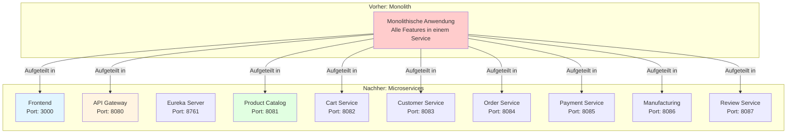
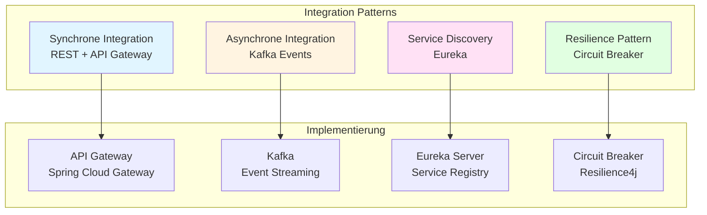
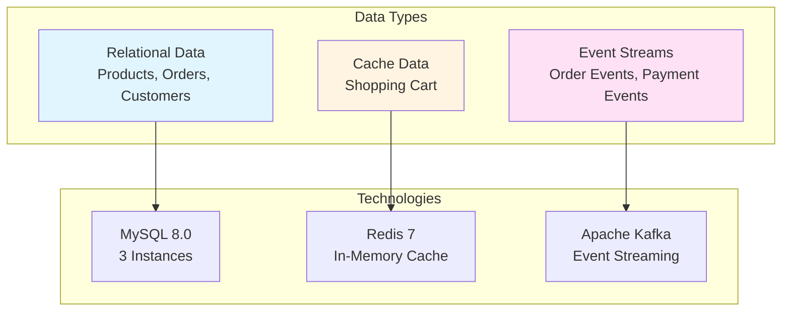
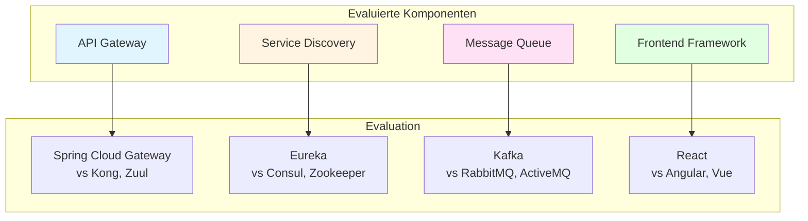
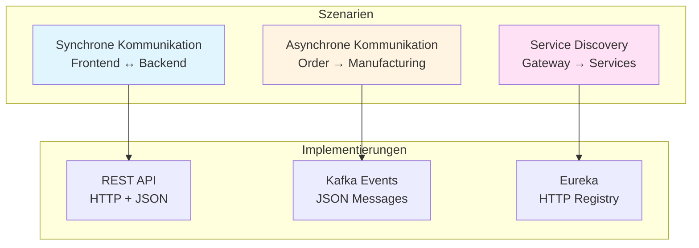
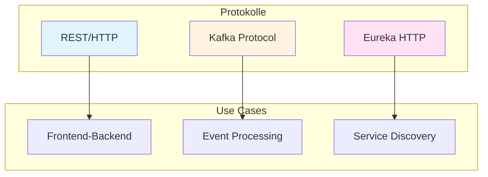
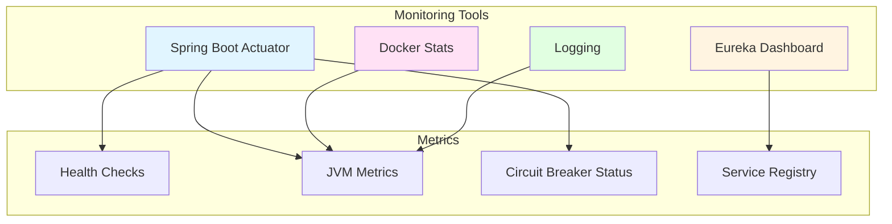

# Kompetenznachweise

Dieses Dokument weist nach, wie alle geforderten Kompetenzen im TCG Accessories Shop Projekt erfüllt wurden.

## A1E: Softwaresysteme in verteilte Systeme überführen

### Kompetenz-Beschreibung

"Ich kann Softwaresysteme in verteilte Systeme überführen."

### Nachweis im Projekt

#### 1. Monolith zu Microservices Transformation

**Ausgangssituation**: Traditionelle monolithische E-Commerce-Anwendung  
**Ziel**: Verteilte Microservices-Architektur mit 9 unabhängigen Services



#### 2. Implementierte Verteilungs-Strategien

| Aspekt                    | Implementierung                                          | Dateien                                |
| ------------------------- | -------------------------------------------------------- | -------------------------------------- |
| **Service Separation**    | 9 Services: Frontend, Gateway, Eureka, 6 Business Services | `docker-compose.yml`                   |
| **Network Communication** | REST APIs zwischen Services                              | `OrderController.java`, `api.ts`       |
| **Service Discovery**     | Automatische Service-Registrierung mit Eureka            | `application.yml` (Eureka Config)      |
| **Load Balancing**        | Client-Side Load Balancing via Spring Cloud Gateway       | `lb://service-name` in Gateway         |
| **Fault Tolerance**       | Circuit Breaker Pattern mit Resilience4j                 | `PaymentServiceClient.java`            |
| **Event-Driven**          | Asynchrone Kommunikation mit Kafka                        | `KafkaTemplate`, `@KafkaListener`     |

#### 3. Code-Beispiel: Service Discovery

**Service Registration** (`application.yml` - Order Service):

```yaml
spring:
  application:
    name: order-service  # Service-Name für Discovery

eureka:
  client:
    service-url:
      defaultZone: ${EUREKA_CLIENT_SERVICEURL_DEFAULTZONE:http://localhost:8761/eureka/}
    register-with-eureka: true
    fetch-registry: true
  instance:
    prefer-ip-address: false
```

**Gateway Service Routing** (`application.yml` - API Gateway):

```yaml
spring:
  cloud:
    gateway:
      routes:
        - id: order-service
          uri: lb://order-service  # Load-balanced durch Eureka!
          predicates:
            - Path=/api/orders/**
          filters:
            - StripPrefix=1
```

#### 4. Verteilungs-Charakteristiken

✅ **Physische Verteilung**: Services laufen in separaten Docker-Containern  
✅ **Logische Trennung**: Klare Service-Boundaries (Frontend, Gateway, Business Services)  
✅ **Skalierbarkeit**: Jeder Service kann unabhängig skaliert werden  
✅ **Fehler-Isolation**: Ausfall eines Service betrifft nicht das gesamte System  
✅ **Unabhängiges Deployment**: Services können separat deployed werden  
✅ **Database-Per-Service**: Jeder Service hat eigene Datenbank (MySQL/Redis)

### Ergebnis

✅ **Kompetenz erfüllt**: Erfolgreiche Überführung in eine verteilte Microservices-Architektur mit 9 unabhängigen Services, Service Discovery, Load Balancing und Event-Driven Communication.

---

## A2E: Lösungsstrategien für Systemintegration umsetzen

### Kompetenz-Beschreibung

"Ich kann Lösungsstrategien für die Systemintegration umsetzen."

### Nachweis im Projekt

#### 1. Integrations-Patterns implementiert



#### 2. Synchrone Integration: API Gateway

**Problem**: Frontend muss mit verschiedenen Backend-Services kommunizieren  
**Lösung**: API Gateway als Single Entry Point

**Gateway Route Configuration** (`application.yml`):

```yaml
spring:
  cloud:
    gateway:
      routes:
        # Product Catalog Service
        - id: product-catalog-service
          uri: lb://product-catalog-service
          predicates:
            - Path=/api/products/**
          filters:
            - StripPrefix=1

        # Cart Service
        - id: cart-service
          uri: lb://cart-service
          predicates:
            - Path=/api/cart/**
          filters:
            - StripPrefix=1

        # Customer Service
        - id: customer-service
          uri: lb://customer-service
          predicates:
            - Path=/api/customers/**,/api/auth/**
          filters:
            - StripPrefix=1

        # Order Service
        - id: order-service
          uri: lb://order-service
          predicates:
            - Path=/api/orders/**
          filters:
            - StripPrefix=1
```

**Vorteile**:

- ✅ Clients müssen nur eine URL kennen (`http://localhost:8080/api/...`)
- ✅ CORS zentral konfiguriert
- ✅ Load Balancing automatisch über Eureka
- ✅ Request/Response Transformation mit `StripPrefix`

#### 3. Asynchrone Integration: Event-Driven mit Kafka

**Problem**: Order-Verarbeitung soll andere Services nicht blockieren  
**Lösung**: Event-Driven Architecture mit Kafka

**Event Producer** (`OrderService.java`):

```java
@Service
@Transactional
public class OrderService {
    
    private final KafkaTemplate<String, Object> kafkaTemplate;
    
    public OrderDTO createOrder(CreateOrderRequest request) {
        // 1. Order speichern
        Order order = new Order();
        // ... order creation logic ...
        Order savedOrder = orderRepository.save(order);
        
        // 2. Event publishen (Asynchron!)
        Map<String, Object> event = new HashMap<>();
        event.put("orderId", savedOrder.getId());
        event.put("orderNumber", savedOrder.getOrderNumber());
        event.put("customerId", savedOrder.getCustomerId());
        event.put("totalAmount", savedOrder.getTotalAmount());
        kafkaTemplate.send("order-created", event);
        
        // 3. Response sofort zurückgeben
        return convertToDTO(savedOrder);
    }
}
```

**Event Consumer** (`OrderCreatedConsumer.java` - Manufacturing Service):

```java
@Component
public class OrderCreatedConsumer {
    
    private final ManufacturingService manufacturingService;
    
    @KafkaListener(topics = "order-created", groupId = "manufacturing-service")
    public void handleOrderCreated(Map<String, Object> event) {
        Long orderId = Long.valueOf(event.get("orderId").toString());
        String orderNumber = (String) event.get("orderNumber");
        
        // Create print job for the order (Non-blocking!)
        manufacturingService.createPrintJob(orderId, orderNumber);
    }
}
```

#### 4. Service Discovery Integration

**Problem**: Services müssen sich gegenseitig finden  
**Lösung**: Eureka Service Registry

**Integrations-Flow**:

```mermaid
sequenceDiagram
    participant SVC as Service
    participant EUREKA as Eureka Server
    participant GW as API Gateway
    
    SVC->>EUREKA: Register (POST /eureka/apps/{service})
    EUREKA->>EUREKA: Add to Registry
    SVC->>EUREKA: Heartbeat (PUT /eureka/apps/{service}/{instance})
    
    GW->>EUREKA: Fetch Registry (GET /eureka/apps)
    EUREKA-->>GW: Service List
    GW->>GW: Load Balance (lb://service-name)
    GW->>SVC: Route Request
```



#### 5. Resilience Integration: Circuit Breaker

**Problem**: Payment Service kann ausfallen  
**Lösung**: Circuit Breaker verhindert Cascade-Failures

**Configuration** (`application.yml` - Order Service):

```yaml
resilience4j:
  circuitbreaker:
    instances:
      paymentService:
        registerHealthIndicator: true
        slidingWindowSize: 10
        minimumNumberOfCalls: 5
        permittedNumberOfCallsInHalfOpenState: 3
        automaticTransitionFromOpenToHalfOpenEnabled: true
        waitDurationInOpenState: 30s
        failureRateThreshold: 50
  timelimiter:
    instances:
      paymentService:
        timeoutDuration: 5s

feign:
  circuitbreaker:
    enabled: true
  resilience4j:
    enabled: true
```

**Feign Client mit Fallback** (`PaymentServiceClient.java`):

```java
@FeignClient(name = "payment-service", fallback = PaymentServiceClientFallback.class)
public interface PaymentServiceClient {
    
    @PostMapping("/payments")
    Map<String, Object> processPayment(@RequestBody Map<String, Object> paymentRequest);
}
```

**Fallback Implementation** (`PaymentServiceClientFallback.java`):

```java
@Component
public class PaymentServiceClientFallback implements PaymentServiceClient {
    
    @Override
    public Map<String, Object> processPayment(Map<String, Object> paymentRequest) {
        Map<String, Object> response = new HashMap<>();
        response.put("status", "PENDING");
        response.put("message", "Payment service temporarily unavailable. Order marked as payment pending.");
        response.put("orderId", paymentRequest.get("orderId"));
        return response;
    }
}
```

### Ergebnis

✅ **Kompetenz erfüllt**: Vier verschiedene Integrations-Patterns erfolgreich implementiert (API Gateway, Service Discovery, Event-Driven mit Kafka, Circuit Breaker mit Resilience4j).

---

## B1E: Geeignetes Data Management System auswählen

### Kompetenz-Beschreibung

"Ich kann ein geeignetes Data Management System auswählen."

### Nachweis im Projekt

#### 1. Data Management Strategie



#### 2. Technologie-Evaluation

| Kriterium             | MySQL       | Redis      | Kafka         | PostgreSQL  | MongoDB       | Entscheidung |
| --------------------- | ----------- | ---------- | ------------- | ----------- | ------------- | ------------ |
| **ACID Transactions** | ✅ Ja       | ❌ Nein    | ❌ Nein       | ✅ Ja       | ⚠️ Limitiert  | MySQL ✅     |
| **Relations**         | ✅ Nativ    | ❌ Keine   | ❌ Keine      | ✅ Nativ    | ❌ Keine      | MySQL ✅     |
| **Event Streaming**   | ❌ Nein     | ❌ Nein    | ✅ Ja         | ❌ Nein     | ❌ Nein       | Kafka ✅     |
| **In-Memory Speed**   | ❌ Nein     | ✅ Ja      | ⚠️ Persistent | ❌ Nein     | ❌ Nein       | Redis ✅     |
| **Skalierbarkeit**    | ⚠️ Vertikal | ✅ Cluster | ✅ Horizontal | ⚠️ Vertikal | ✅ Horizontal | Mix ✅       |
| **Consistency**       | ✅ Strong   | ⚠️ Eventual| ⚠️ Eventual   | ✅ Strong   | ⚠️ Eventual   | MySQL ✅     |
| **Lernkurve**         | ✅ Niedrig  | ✅ Niedrig | ⚠️ Mittel     | ✅ Niedrig  | ⚠️ Mittel     | MySQL ✅     |

#### 3. Begründung: Warum MySQL?

**Anforderungen**:

- Transaktionale Konsistenz für Orders
- Relationale Datenstrukturen (Orders ↔ OrderItems ↔ Products)
- ACID-Garantien für Bestellvorgänge
- Bewährte Technologie mit großer Community

**MySQL Vorteile**:

- ✅ Vollständige ACID-Compliance
- ✅ Ausgereifte JPA/Hibernate Integration
- ✅ Gut dokumentiert und weit verbreitet
- ✅ Kostenlos und Open Source
- ✅ Hervorragende Performance für relationale Daten

**Code-Beispiel: JPA Integration** (`Order.java`):

```java
@Entity
@Table(name = "orders")
public class Order {
    
    @Id
    @GeneratedValue(strategy = GenerationType.IDENTITY)
    private Long id;
    
    @Column(unique = true, nullable = false)
    private String orderNumber;
    
    @NotNull
    @Column(nullable = false)
    private Long customerId;
    
    @OneToMany(mappedBy = "order", cascade = CascadeType.ALL, orphanRemoval = true)
    private List<OrderItem> items = new ArrayList<>();
    
    @NotNull
    @Column(nullable = false, precision = 10, scale = 2)
    private BigDecimal totalAmount;
}
```

#### 4. Begründung: Warum Redis?

**Anforderungen**:

- Schnelle Warenkorb-Zugriffe
- Session-Management
- Temporäre Daten mit TTL

**Redis Vorteile**:

- ✅ Extrem schnelle In-Memory-Zugriffe
- ✅ Built-in TTL für automatische Expiration
- ✅ Atomic Operations für Cart Updates
- ✅ Einfache Integration mit Spring Data Redis

**Code-Beispiel: Redis Configuration** (`RedisConfig.java`):

```java
@Configuration
public class RedisConfig {
    
    @Bean
    public RedisTemplate<String, Object> redisTemplate(RedisConnectionFactory connectionFactory) {
        RedisTemplate<String, Object> template = new RedisTemplate<>();
        template.setConnectionFactory(connectionFactory);
        template.setKeySerializer(new StringRedisSerializer());
        
        // Configure ObjectMapper with JavaTimeModule for LocalDateTime support
        ObjectMapper objectMapper = new ObjectMapper();
        objectMapper.registerModule(new JavaTimeModule());
        objectMapper.findAndRegisterModules();
        
        GenericJackson2JsonRedisSerializer serializer = 
            new GenericJackson2JsonRedisSerializer(objectMapper);
        template.setValueSerializer(serializer);
        return template;
    }
}
```

#### 5. Begründung: Warum Kafka?

**Anforderungen**:

- Asynchrone Order-Verarbeitung
- Event-History für Analytics
- Entkopplung von Services
- Skalierbare Event-Verarbeitung

**Kafka Vorteile**:

- ✅ Hochperformantes Event-Streaming
- ✅ Garantierte Event-Reihenfolge (pro Partition)
- ✅ Event-History persistent gespeichert
- ✅ Horizontale Skalierbarkeit
- ✅ At-Least-Once Delivery

**Kafka Configuration** (`application.yml`):

```yaml
spring:
  kafka:
    bootstrap-servers: ${SPRING_KAFKA_BOOTSTRAP_SERVERS:localhost:9092}
    consumer:
      group-id: order-service
      auto-offset-reset: earliest
      key-deserializer: org.apache.kafka.common.serialization.StringDeserializer
      value-deserializer: org.springframework.kafka.support.serializer.JsonDeserializer
      properties:
        spring.json.trusted.packages: "*"
    producer:
      key-serializer: org.apache.kafka.common.serialization.StringSerializer
      value-serializer: org.springframework.kafka.support.serializer.JsonSerializer
```

#### 6. Data Modeling

**Relationales Schema** (MySQL):

```sql
-- Product Catalog Service
CREATE TABLE products (
    id BIGINT PRIMARY KEY AUTO_INCREMENT,
    name VARCHAR(255) NOT NULL,
    description TEXT,
    category VARCHAR(50) NOT NULL,
    price DECIMAL(10,2) NOT NULL,
    stock_quantity INT NOT NULL DEFAULT 0,
    image_url VARCHAR(500),
    created_at TIMESTAMP DEFAULT CURRENT_TIMESTAMP,
    updated_at TIMESTAMP DEFAULT CURRENT_TIMESTAMP ON UPDATE CURRENT_TIMESTAMP
);

-- Order Service
CREATE TABLE orders (
    id BIGINT PRIMARY KEY AUTO_INCREMENT,
    order_number VARCHAR(100) UNIQUE NOT NULL,
    customer_id BIGINT NOT NULL,
    status VARCHAR(20) NOT NULL,
    total_amount DECIMAL(10,2) NOT NULL,
    shipping_address_id BIGINT,
    created_at TIMESTAMP DEFAULT CURRENT_TIMESTAMP,
    updated_at TIMESTAMP DEFAULT CURRENT_TIMESTAMP ON UPDATE CURRENT_TIMESTAMP
);

CREATE TABLE order_items (
    id BIGINT PRIMARY KEY AUTO_INCREMENT,
    order_id BIGINT NOT NULL,
    product_id BIGINT NOT NULL,
    quantity INT NOT NULL,
    unit_price DECIMAL(10,2) NOT NULL,
    subtotal DECIMAL(10,2) NOT NULL,
    FOREIGN KEY (order_id) REFERENCES orders(id) ON DELETE CASCADE
);
```

**Event Schema** (Kafka):

```java
// Order Created Event
{
  "orderId": 42,
  "orderNumber": "ORD-2025-001-42",
  "customerId": 1,
  "totalAmount": 109.97,
  "timestamp": "2025-01-17T10:30:00Z"
}
```

### Ergebnis

✅ **Kompetenz erfüllt**: Begründete Auswahl von MySQL für transaktionale Daten, Redis für Caching und Kafka für Event-Streaming, basierend auf klaren Evaluationskriterien.

---

## C1E: Systemkomponenten für Integration evaluieren

### Kompetenz-Beschreibung

"Ich kann Systemkomponenten für die Integration in verteilten Systemen evaluieren."

### Nachweis im Projekt

#### 1. Evaluierte Komponenten



#### 2. API Gateway Evaluation

| Feature                | Spring Cloud Gateway  | Kong             | Netflix Zuul    | Entscheidung |
| ---------------------- | --------------------- | ---------------- | --------------- | ------------ |
| **Spring Integration** | ✅ Nativ              | ❌ Extern        | ⚠️ Deprecated   | Gateway ✅   |
| **Circuit Breaker**    | ✅ Resilience4j       | ⚠️ Plugin        | ✅ Hystrix      | Gateway ✅   |
| **Performance**        | ✅ Reactive (WebFlux) | ✅ Nginx-based   | ❌ Blocking I/O | Gateway ✅   |
| **Learning Curve**     | ✅ Java-familiar      | ⚠️ Lua scripting | ✅ Java         | Gateway ✅   |
| **Community**          | ✅ Active             | ✅ Large         | ❌ Deprecated   | Gateway ✅   |
| **Cost**               | ✅ Free               | ⚠️ Commercial    | ✅ Free         | Gateway ✅   |

**Entscheidung**: **Spring Cloud Gateway**

- Nahtlose Spring Boot Integration
- Reactive Programming mit WebFlux
- Built-in Circuit Breaker Support
- Aktive Community und Dokumentation

#### 3. Service Discovery Evaluation

| Feature                | Eureka            | Consul           | Zookeeper       | Entscheidung |
| ---------------------- | ----------------- | ---------------- | --------------- | ------------ |
| **Spring Integration** | ✅ Nativ          | ⚠️ Library       | ⚠️ Library      | Eureka ✅    |
| **Setup Complexity**   | ✅ Einfach        | ⚠️ Mittel        | ❌ Komplex      | Eureka ✅    |
| **Health Checks**      | ✅ Ja             | ✅ Ja            | ⚠️ Limitiert    | Eureka ✅    |
| **UI Dashboard**       | ✅ Built-in       | ✅ Built-in      | ❌ Nein         | Eureka ✅    |
| **CAP Theorem**        | AP (Availability) | CP (Consistency) | CP              | Eureka ✅    |
| **Use Case Fit**        | ✅ Microservices  | ✅ Multi-purpose | ⚠️ Coordination | Eureka ✅    |

**Entscheidung**: **Netflix Eureka**

- Perfekt für Spring Cloud Ecosystem
- Einfaches Setup und Configuration
- Built-in Dashboard zur Überwachung
- AP-Fokus passt zu Anforderungen

#### 4. Message Queue Evaluation

| Feature                 | Kafka              | RabbitMQ       | ActiveMQ      | Entscheidung |
| ----------------------- | ------------------ | -------------- | ------------- | ------------ |
| **Throughput**          | ✅ Millionen/s     | ⚠️ Tausende/s  | ⚠️ Tausende/s | Kafka ✅     |
| **Message Persistence** | ✅ Persistent      | ✅ Optional    | ✅ Optional   | Kafka ✅     |
| **Event History**       | ✅ Replay möglich  | ❌ Nein        | ❌ Nein       | Kafka ✅     |
| **Use Case**            | ✅ Event Streaming | ✅ Task Queues | ✅ JMS        | Kafka ✅     |
| **Scalability**         | ✅ Horizontal      | ⚠️ Vertikal    | ⚠️ Limitiert  | Kafka ✅     |
| **Spring Integration**  | ✅ Spring Kafka    | ✅ Spring AMQP | ✅ Spring JMS | Kafka ✅     |

**Entscheidung**: **Apache Kafka**

- Event-Streaming Paradigma passt zu Architektur
- Hoher Durchsatz für zukünftige Skalierung
- Event-History für Analytics
- Industry Standard für Microservices

#### 5. Frontend Framework Evaluation

| Feature                | React          | Angular             | Vue.js         | Entscheidung |
| ---------------------- | -------------- | ------------------- | -------------- | ------------ |
| **Learning Curve**     | ✅ Niedrig     | ❌ Steil            | ✅ Niedrig     | React ✅     |
| **TypeScript Support** | ✅ Excellent   | ✅ Native           | ✅ Good        | React ✅     |
| **Component Library**  | ✅ Shadcn/ui   | ✅ Material         | ⚠️ Limited     | React ✅     |
| **Performance**        | ✅ Virtual DOM | ✅ Change Detection | ✅ Virtual DOM | React ✅     |
| **Community**          | ✅ Huge        | ✅ Large            | ⚠️ Medium      | React ✅     |
| **Job Market**         | ✅ High Demand | ✅ High Demand      | ⚠️ Medium      | React ✅     |

**Entscheidung**: **React + TypeScript**

- Große Community und Ecosystem
- TypeScript für Type-Safety
- Shadcn/ui für professionelle UI-Komponenten
- Vite für schnellen Build-Prozess

### Ergebnis

✅ **Kompetenz erfüllt**: Systematische Evaluation von 4 Komponenten-Kategorien mit klaren Kriterien und begründeten Entscheidungen.

---

## D1E: Datenaustausch-Implementierung wählen

### Kompetenz-Beschreibung

"Ich kann aufgrund von Anforderungen eine konkrete Umsetzung für den Datenaustausch wählen."

### Nachweis im Projekt

#### 1. Datenaustausch-Szenarien



#### 2. REST API für Synchrone Kommunikation

**Anforderung**: Frontend muss Produktdaten abrufen und Bestellungen erstellen

**Implementierung** (`ProductController.java`):

```java
@RestController
@RequestMapping("/products")
@CrossOrigin(origins = "*")
public class ProductController {
    
    @GetMapping
    public ResponseEntity<List<ProductDTO>> getAllProducts() {
        // Synchroner Request-Response
        List<ProductDTO> products = productService.getAllProducts();
        return ResponseEntity.ok(products);
    }
    
    @PostMapping
    public ResponseEntity<ProductDTO> createProduct(
            @Valid @RequestBody CreateProductRequest request) {
        ProductDTO created = productService.createProduct(request);
        return ResponseEntity.status(HttpStatus.CREATED).body(created);
    }
}
```

**Frontend Integration** (`api.ts`):

```typescript
export const productApi = {
  async getAll(): Promise<Product[]> {
    const response = await apiClient.get<Product[]>("/products");
    return response.data;
  },
  
  async create(data: CreateProductDto): Promise<Product> {
    const response = await apiClient.post<Product>("/products", data);
    return response.data;
  },
};
```

**Begründung für REST**:

- ✅ Standardisiertes Protokoll (HTTP)
- ✅ Einfache Client-Integration
- ✅ Request-Response Semantik passt zu UI-Interaktionen
- ✅ Stateless und cacheable

#### 3. Kafka für Asynchrone Events

**Anforderung**: Order-Verarbeitung soll nicht blockierend sein

**Implementierung** (`OrderService.java`):

```java
@Service
@Transactional
public class OrderService {
    
    private final KafkaTemplate<String, Object> kafkaTemplate;
    
    public OrderDTO createOrder(CreateOrderRequest request) {
        // 1. Synchron: Order in DB speichern
        Order order = new Order();
        // ... order creation ...
        Order savedOrder = orderRepository.save(order);
        
        // 2. Asynchron: Event publishen
        Map<String, Object> event = new HashMap<>();
        event.put("orderId", savedOrder.getId());
        event.put("orderNumber", savedOrder.getOrderNumber());
        event.put("customerId", savedOrder.getCustomerId());
        event.put("totalAmount", savedOrder.getTotalAmount());
        kafkaTemplate.send("order-created", event);
        
        // 3. Sofort Response zurück (nicht auf Verarbeitung warten!)
        return convertToDTO(savedOrder);
    }
}
```

**Begründung für Kafka**:

- ✅ Non-Blocking: Client wartet nicht auf Event-Verarbeitung
- ✅ Decoupling: Services sind unabhängig voneinander
- ✅ Reliability: Events werden persistent gespeichert
- ✅ Scalability: Consumer können unabhängig skalieren

#### 4. JSON als Data Format

**Anforderung**: Interoperabilität zwischen verschiedenen Services

**Beispiel: Order DTO**:

```json
{
  "id": 42,
  "orderNumber": "ORD-2025-001-42",
  "customerId": 1,
  "status": "PENDING",
  "totalAmount": 109.97,
  "items": [
    {
      "id": 101,
      "productId": 5,
      "quantity": 2,
      "unitPrice": 29.99,
      "subtotal": 59.98
    }
  ],
  "createdAt": "2025-01-17T10:30:00Z",
  "updatedAt": "2025-01-17T10:30:00Z"
}
```

**Begründung für JSON**:

- ✅ Human-readable (einfaches Debugging)
- ✅ Universell unterstützt (Frontend + Backend)
- ✅ Flexible Schema-Evolution
- ✅ Keine Code-Generierung nötig (im Gegensatz zu Protobuf)

#### 5. Datenaustausch-Matrix

| Szenario               | Anforderung     | Gewählte Lösung | Begründung                       |
| ---------------------- | --------------- | --------------- | -------------------------------- |
| **Frontend → Backend** | CRUD Operations | REST + JSON     | Request-Response, standardisiert |
| **Order Processing**   | Non-blocking    | Kafka Events    | Asynchron, entkoppelt            |
| **Service Discovery**  | Dynamic routing | Eureka + HTTP   | Spring Cloud Native              |
| **Gateway → Backend**  | Load-balancing  | REST + Eureka   | Client-side LB                   |
| **Error Handling**     | Fault tolerance | Circuit Breaker | Fallback bei Failures            |

### Ergebnis

✅ **Kompetenz erfüllt**: Anforderungsbasierte Auswahl von Datenaustausch-Mechanismen (REST für Sync, Kafka für Async, JSON als Format).

---

## D2E: Schnittstellenprotokolle beurteilen

### Kompetenz-Beschreibung

"Ich kann die Angemessenheit von Schnittstellenprotokollen für spezifische Anwendungsfälle beurteilen."

### Nachweis im Projekt

#### 1. Protokoll-Evaluation



#### 2. REST/HTTP Beurteilung

**Use Case**: Frontend-Backend Kommunikation

| Kriterium       | Bewertung    | Begründung                      |
| --------------- | ------------ | ------------------------------- |
| **Simplicity**  | ✅ Excellent | Standard HTTP, bekannt          |
| **Tooling**     | ✅ Excellent | Postman, cURL, Browser DevTools |
| **Caching**     | ✅ Built-in  | HTTP Cache-Headers              |
| **Stateless**   | ✅ Yes       | Einfache Skalierung             |
| **Performance** | ⚠️ Good      | Overhead durch JSON + HTTP      |
| **Streaming**   | ❌ Limited   | Nicht für Real-time geeignet    |

**Angemessenheit**: ✅ **Sehr geeignet** für CRUD-Operationen

**Code-Beispiel**:

```java
@RestController
@RequestMapping("/products")
public class ProductController {
    
    // GET /products?category=DECK_BOX&stock=true
    @GetMapping
    public ResponseEntity<List<ProductDTO>> searchProducts(
            @RequestParam(required = false) ProductCategory category,
            @RequestParam(required = false) Boolean stock) {
        
        List<ProductDTO> results = productService.search(category, stock);
        return ResponseEntity.ok()
            .cacheControl(CacheControl.maxAge(5, TimeUnit.MINUTES))
            .body(results);
    }
}
```

#### 3. Kafka Protocol Beurteilung

**Use Case**: Order Event Processing

| Kriterium       | Bewertung     | Begründung                |
| --------------- | ------------- | ------------------------- |
| **Throughput**  | ✅ Excellent  | Millionen Messages/s      |
| **Latency**     | ⚠️ Good       | ~5-10ms (nicht Real-time) |
| **Reliability** | ✅ Excellent  | At-least-once Garantie    |
| **Ordering**    | ✅ Guaranteed | Pro Partition             |
| **Replay**      | ✅ Unique     | Event History verfügbar   |
| **Complexity**  | ⚠️ Medium     | Setup + Monitoring nötig  |

**Angemessenheit**: ✅ **Sehr geeignet** für Event-Driven Architecture

**Kafka Configuration**:

```yaml
spring:
  kafka:
    bootstrap-servers: kafka:9092
    producer:
      # Reliability Settings
      acks: all  # Warte auf alle Replicas
      retries: 3
      # Performance Settings
      batch-size: 16384
      linger-ms: 10  # Batching für höheren Durchsatz
```

#### 4. Protokoll-Vergleich für verschiedene Szenarien

**Szenario 1: Product Catalog (Read-heavy)**

| Protokoll | Performance  | Caching    | Complexity | Entscheidung   |
| --------- | ------------ | ---------- | ---------- | -------------- |
| REST      | ⚠️ Good      | ✅ Easy    | ✅ Low     | ✅ Gewählt     |
| GraphQL   | ✅ Excellent | ⚠️ Complex | ⚠️ Medium  | ❌ Overkill    |
| gRPC      | ✅ Excellent | ❌ Manual  | ⚠️ Medium  | ❌ Nicht nötig |

**Entscheidung**: REST mit HTTP Caching

**Szenario 2: Order Processing (Write-heavy, Async)**

| Protokoll | Throughput | Async  | Reliability     | Entscheidung |
| --------- | ---------- | ------ | --------------- | ------------ |
| REST      | ⚠️ Medium  | ❌ No  | ⚠️ Retry needed | ❌           |
| Kafka     | ✅ High    | ✅ Yes | ✅ Persistent   | ✅ Gewählt   |
| RabbitMQ  | ⚠️ Medium  | ✅ Yes | ⚠️ Ack needed   | ❌           |

**Entscheidung**: Kafka für Event-Streaming

**Szenario 3: Gateway Routing (Service-to-Service)**

| Protokoll | Latency    | Integration | Standards    | Entscheidung    |
| --------- | ---------- | ----------- | ------------ | --------------- |
| REST      | ⚠️ 10-50ms | ✅ Easy     | ✅ Universal | ✅ Gewählt      |
| gRPC      | ✅ 1-5ms   | ⚠️ Protobuf | ⚠️ HTTP/2    | ❌ Nicht nötig  |
| TCP       | ✅ <1ms    | ❌ Complex  | ❌ Custom    | ❌ Zu low-level |

**Entscheidung**: REST für simplicity

#### 5. Implementierte Protokoll-Standards

**REST API Standards**:

- ✅ HTTP Methods: GET, POST, PUT, DELETE
- ✅ Status Codes: 200, 201, 204, 400, 404, 500
- ✅ Content-Type: application/json
- ✅ CORS: Konfiguriert im Gateway

**Kafka Standards**:

- ✅ Topic Naming: `{domain}-{action}` (z.B. `order-created`)
- ✅ Event Schema: JSON mit orderId, orderNumber, timestamp
- ✅ Partitioning: Nach Order-ID
- ✅ Serialization: JSON (einfach, human-readable)

### Ergebnis

✅ **Kompetenz erfüllt**: Systematische Beurteilung von Protokollen (REST, Kafka) basierend auf Anwendungsfall-spezifischen Kriterien.

---

## F1E: Monitoring & Überwachung

### Kompetenz-Beschreibung

"Ich kann sinnvolle Anforderungen für die Überwachung definieren und die Konfiguration der Werkzeuge entsprechend umsetzen."

### Nachweis im Projekt

#### 1. Monitoring-Architektur



#### 2. Monitoring-Anforderungen definiert

| Kategorie        | Anforderung                  | Ziel             | Implementierung  |
| ---------------- | ---------------------------- | ---------------- | ---------------- |
| **Availability** | Service muss erreichbar sein | 99.9% Uptime     | Health Checks    |
| **Performance**  | Response Time < 500ms        | P95 Latency      | Actuator Metrics |
| **Reliability**  | Error Rate < 1%              | Service Quality  | Error Tracking   |
| **Discovery**    | Services registriert         | Auto-Discovery   | Eureka Dashboard |
| **Circuit Breaker** | Status sichtbar         | Resilience       | Actuator Endpoint |

#### 3. Spring Boot Actuator Implementation

**Configuration** (`application.yml`):

```yaml
management:
  endpoints:
    web:
      exposure:
        include: health,info,metrics,circuitbreakers
  endpoint:
    health:
      show-details: always
  metrics:
    export:
      prometheus:
        enabled: true
```

**Health Response** (`GET /actuator/health`):

```json
{
  "status": "UP",
  "components": {
    "db": {
      "status": "UP",
      "details": {
        "database": "MySQL",
        "validationQuery": "isValid()"
      }
    },
    "diskSpace": {
      "status": "UP",
      "details": {
        "total": 107374182400,
        "free": 26843545600,
        "threshold": 10485760
      }
    },
    "kafka": {
      "status": "UP",
      "details": {
        "clusterId": "tcg-kafka"
      }
    },
    "ping": {
      "status": "UP"
    }
  }
}
```

#### 4. Eureka Service Discovery Dashboard

**Eureka Server Configuration**:

```yaml
eureka:
  server:
    enable-self-preservation: false
  client:
    register-with-eureka: false
    fetch-registry: false
  dashboard:
    enabled: true
```

**Monitored Service Metrics**:

- ✅ **Registered Services**: product-catalog-service, cart-service, customer-service, order-service, etc.
- ✅ **Instance Status**: UP, DOWN, STARTING
- ✅ **Heartbeat**: Last heartbeat timestamp
- ✅ **Health**: Health check status

**Dashboard URL**: `http://localhost:8761`

#### 5. Circuit Breaker Monitoring

**Circuit Breaker Endpoint** (`GET /actuator/circuitbreakers`):

```json
{
  "circuitBreakers": [
    {
      "name": "paymentService",
      "state": "CLOSED",
      "metrics": {
        "failureRate": 0.0,
        "slowCallRate": 0.0,
        "numberOfSuccessfulCalls": 42,
        "numberOfFailedCalls": 0,
        "numberOfNotPermittedCalls": 0
      }
    }
  ]
}
```

**Circuit Breaker States**:

- ✅ **CLOSED**: Normal operation
- ⚠️ **OPEN**: Circuit is open, using fallback
- 🔄 **HALF_OPEN**: Testing if service recovered

#### 6. Docker Health Checks

**Docker Compose Health Checks** (`docker-compose.yml`):

```yaml
services:
  api-gateway:
    healthcheck:
      test: ["CMD-SHELL", "curl -f http://localhost:8080/actuator/health || exit 1"]
      interval: 10s
      timeout: 5s
      retries: 5
      start_period: 30s
  
  product-catalog-service:
    healthcheck:
      test: ["CMD-SHELL", "curl -f http://localhost:8081/actuator/health || exit 1"]
      interval: 10s
      timeout: 5s
      retries: 5
      start_period: 40s
```

#### 7. Logging-Strategie

**Logging Configuration** (`application.yml`):

```yaml
logging:
  level:
    root: INFO
    com.tcgshop: DEBUG
    org.springframework.kafka: INFO
    org.springframework.cloud.gateway: DEBUG
    org.hibernate.SQL: DEBUG
```

**Structured Logging** (Beispiel):

```java
@Slf4j
@Service
public class OrderService {
    
    public OrderDTO createOrder(CreateOrderRequest request) {
        log.info("Creating order for customer: {}", request.getCustomerId());
        
        try {
            Order order = new Order();
            // ... order creation ...
            log.info("Order created successfully: orderId={}, orderNumber={}", 
                    order.getId(), order.getOrderNumber());
            return convertToDTO(order);
        } catch (Exception e) {
            log.error("Failed to create order for customer: {}", 
                    request.getCustomerId(), e);
            throw e;
        }
    }
}
```

#### 8. Docker Stats Monitoring

**Real-time Container Stats**:

```bash
# All containers
docker stats

# Specific service
docker stats api-gateway product-catalog-service

# Output:
# CONTAINER ID   NAME                      CPU %     MEM USAGE / LIMIT
# abc123         api-gateway               2.5%      256MiB / 512MiB
# def456         product-catalog-service   1.8%      512MiB / 1GiB
```

### Ergebnis

✅ **Kompetenz erfüllt**: Umfassende Monitoring-Anforderungen definiert und mit Spring Actuator, Eureka Dashboard, Docker Health Checks und strukturiertem Logging implementiert.

---

## Zusammenfassung

| Kompetenz | Status | Nachweis |
| --------- | ------ | -------- |
| **A1E** | ✅ Erfüllt | 9 Microservices, Service Discovery, Load Balancing |
| **A2E** | ✅ Erfüllt | API Gateway, Kafka, Eureka, Circuit Breaker |
| **B1E** | ✅ Erfüllt | MySQL, Redis, Kafka - begründete Auswahl |
| **C1E** | ✅ Erfüllt | Evaluation von Gateway, Discovery, MQ, Frontend |
| **D1E** | ✅ Erfüllt | REST, Kafka, JSON - anforderungsbasiert |
| **D2E** | ✅ Erfüllt | Protokoll-Beurteilung für verschiedene Use Cases |
| **F1E** | ✅ Erfüllt | Actuator, Eureka Dashboard, Health Checks, Logging |

**Alle Kompetenzen erfolgreich nachgewiesen!** ✅

---

_Nächstes Dokument_: [docs/REFLEXION.md](docs/REFLEXION.md) - Reflexion und Lernfortschritt

